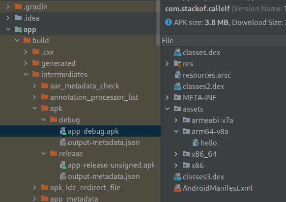
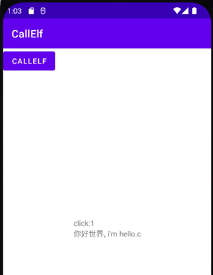

# 在android12中通过apk调用可执行文件
## 更新
2022.06.22
增加了输入框，可以从界面传参数给可执行文件

## 参考

https://www.cnblogs.com/andrewwang/p/11024891.html

https://cloud.tencent.com/developer/article/1446603   有图

主要参考这篇，但里面有些已经不适用新版本了。

## 前提

androidstudio,jdk,ndk都已经完成安装和配置

## 创建项目

File-NewProject-EmptyActivity

Name:CallElf

PackageName:com.stackof.callelf

## 增加控件

### layout

ResourceManager-Layout-activity_main

默认已经有一个TextView，在Attributes-id中增加id textView1

新增一个按钮

id:button1

text:CallElf

onClick:bt1_click


### activity_main.xml

```java
<?xml version="1.0" encoding="utf-8"?>
<androidx.constraintlayout.widget.ConstraintLayout xmlns:android="http://schemas.android.com/apk/res/android"
    xmlns:app="http://schemas.android.com/apk/res-auto"
    xmlns:tools="http://schemas.android.com/tools"
    android:layout_width="match_parent"
    android:layout_height="match_parent"

    tools:context=".MainActivity">

    <TextView
        android:id="@+id/textView1"
        android:layout_width="wrap_content"
        android:layout_height="wrap_content"
        android:text="Hello World!"
        app:layout_constraintBottom_toBottomOf="parent"
        app:layout_constraintLeft_toLeftOf="parent"
        app:layout_constraintRight_toRightOf="parent"
        app:layout_constraintTop_toTopOf="parent" />

    <Button
        android:id="@+id/button1"
        android:layout_width="wrap_content"
        android:layout_height="wrap_content"
        android:text="CallElf"
        android:onClick="bt1_click"
        tools:layout_editor_absoluteX="157dp"
        tools:layout_editor_absoluteY="386dp" />

</androidx.constraintlayout.widget.ConstraintLayout>
```

### MainActivity.java

```java
package com.stackof.callelf;

import androidx.appcompat.app.AppCompatActivity;

import android.os.Bundle;

import android.widget.TextView;
import android.view.View;

public class MainActivity extends AppCompatActivity {
    String Tag = "StackOF";
    TextView textview1;
    int c=0;
    @Override
    protected void onCreate(Bundle savedInstanceState) {
        super.onCreate(savedInstanceState);
        setContentView(R.layout.activity_main);

        textview1=(TextView)findViewById(R.id.textView1);

    }
    public void bt1_click(View view){
        c = c+1;
        textview1.setText("click:"+c+"\n"+callElf("hello"));
    }
}

```

## 可执行文件编译及打包

在main目录下新建jni目录

### Application.mk

```
APP_ABI := all
```

### Android.mk

```
LOCAL_PATH := $(call my-dir)
include $(CLEAR_VARS)
LOCAL_MODULE := hello
LOCAL_SRC_FILES := hello.c
include $(BUILD_EXECUTABLE)
```

### hello.c

```
#include<stdio.h>

int main(int argc, char **argv){
    printf("你好世界, i'm hello.c\n");
    return 0;
}
```

### 配置编译

app/build.gradle

在android一节中，defaultConfig之后、buildTypes之前增加如下代码：

```
    externalNativeBuild {
        ndkBuild {
            path "src/main/jni/Android.mk"
        }
    }
```

### 编译结果打包进入APK

app/build.gradle

在android一节中，defaultConfig之后

```
    sourceSets{
        main{
            assets.srcDirs 'build/intermediates/ndkBuild/release/obj/local'
        }
    }
    aaptOptions {
        ignoreAssetsPattern '!*.txt:!*.so:!*debug:!*release:!*.a'
    }
```

build/intermediates/ndkBuild/release/obj/local或是build/intermediates/ndkBuild/debug/obj/local，看编译的类型

编译类型可以最左侧面板BuildVariants中设置

这样设置后可执行文件会被放在打包的apk的assets目录下

## 把可执行程序拷贝到程序目录下

需要把可执行文件从打包的apk中拷贝到程序私有目录下才能执行。这里把程序拷贝到

```
/data/data/{pkgname}/executable下
```

在java目录下新增文件copyElfs.java

其中assetsFiles是要拷贝的文件名，可以有多个。

    String[] assetsFiles ={
            "hello"
    };


```java
package com.stackof.callelf;


import android.content.Context;
import android.content.res.AssetManager;
import android.os.Build;
import android.util.Log;

import androidx.annotation.RequiresApi;

import java.io.File;
import java.io.FileOutputStream;
import java.io.IOException;
import java.io.InputStream;
import java.io.OutputStream;
import java.util.Arrays;
import java.util.List;

public class copyElfs {
    String tag="StackOF:";
    Context ct;
    String appFileDirectory, executableFilePath;
    AssetManager assetManager;
    List resList;
    String cpuType;
    String[] assetsFiles ={
            "hello"
    };

    @RequiresApi(api = Build.VERSION_CODES.N)
    copyElfs(Context c){
        ct=c;

//        appFileDirectory = ct.getFilesDir().getPath();
        appFileDirectory = "/data/data/"+ct.getPackageName();

        executableFilePath = appFileDirectory + "/executable";
        Log.e(tag, "cpu type:"+ cpuType);
//        cputype = Build.SUPPORTED_ABIS[0];
        cpuType = Build.CPU_ABI;
        Log.e(tag, "cpu type:"+ cpuType);
        assetManager = ct.getAssets();
        try {
            resList = Arrays.asList(ct.getAssets().list(cpuType +"/"));
            Log.d(tag,"get assets list:"+ resList.toString());
        } catch (IOException e){
            Log.e(tag, "error list assets folder:", e);
        }
    }
    boolean resFileExist(String filename){
        File f=new File(executableFilePath +"/"+filename);
        if (f.exists())
            return true;
        return false;
    }
    void copyFile(InputStream in, OutputStream out){
        try {
            byte[] buf = new byte[1024];
            int len;
            while ((len = in.read(buf)) > 0) {
                out.write(buf, 0, len);
            }
        } catch (IOException e){
            Log.e(tag, "failed to read/write asset file: ", e);
        }
    };
    private void copyAssets(String filename) {
        InputStream in = null;
        OutputStream out = null;
        Log.d(tag, "attempting to copy this file: " + filename);

        try {
            in = assetManager.open(cpuType +"/"+filename);
            File outfile = new File(executableFilePath, filename);
            out = new FileOutputStream(outfile);
            copyFile(in, out);
            in.close();
            in = null;
            out.flush();
            out.close();
            out = null;
        } catch(IOException e) {
            Log.e(tag, "failed to copy asset file: " + filename, e);
        }
        Log.d(tag, "copy success: " + filename);
    }
    void copyAll2Data(){
        int i;

        File folder=new File(executableFilePath);
        if (!folder.exists()){
            folder.mkdir();
        }

        for(i=0; i< assetsFiles.length; i++){
            if (!resFileExist(assetsFiles[i])){
                copyAssets(assetsFiles[i]);
                File execfile = new File(executableFilePath +"/"+ assetsFiles[i]);
                execfile.setExecutable(true);
            }
        }
    }

    String getExecutableFilePath(){
        return executableFilePath;
    }
}

```

## 可执行文件调用

在MainActivity.java中增加调用可执行文件的函数。

在android12中是不允许直接调用可执行文件的，直接调用会提示无权限。需要使用/system/bin/linker64来调用。

```java
copyElfs ce;

    protected void onCreate(Bundle savedInstanceState) {
        super.onCreate(savedInstanceState);
        setContentView(R.layout.activity_main);

        textview1=(TextView)findViewById(R.id.textView1);
		//把可执行文件复制到目录
		ce = new copyElfs(getBaseContext());
        ce.copyAll2Data();

    }

    public String callElf(String cmd){
        Process p;
        String tmptext;
        String execresult = "";

        try {
            p = Runtime.getRuntime().exec("/system/bin/linker64 "+ce.getExecutableFilePath() + "/"+cmd);
            BufferedReader br = new BufferedReader(new InputStreamReader(p.getInputStream()));
            while ((tmptext = br.readLine()) != null) {
                execresult += tmptext+"\n";
            }
        }catch (IOException e){
            Log.i(Tag,e.toString());
        }
        return execresult;
    }
```

## 编译

编译后可以直接看apk的结构，可以看到assets下面有hello这个文件



## 运行

运行后点击CallElf，出现hello.c说明执行成功了。


